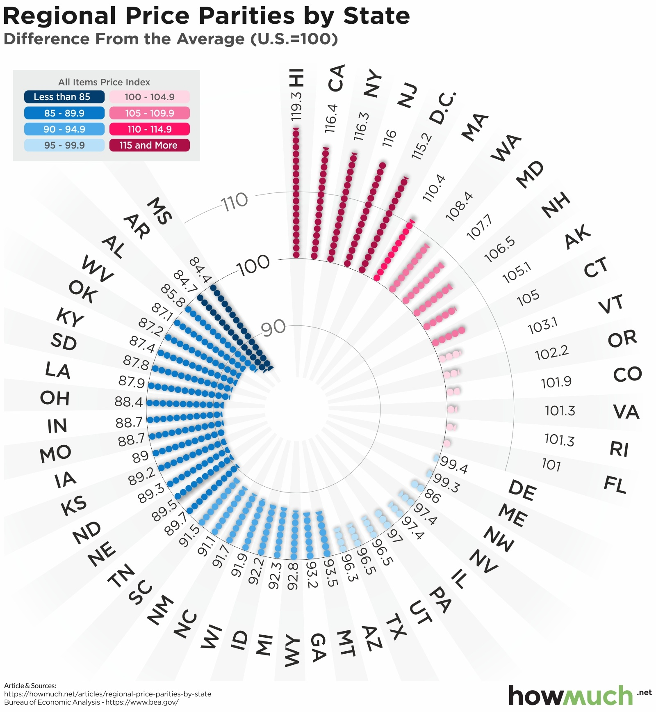
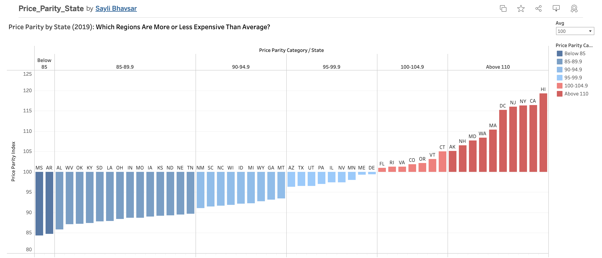

| [home page](https://saylibhavsar.github.io/Data-Visualization-Projects/) | [visualizing debt](https://saylibhavsar.github.io/Data-Visualization-Projects/visualizing-government-debt.html) | [critique by design](https://saylibhavsar.github.io/Data-Visualization-Projects/critique-by-design.html) | [final project I](https://saylibhavsar.github.io/Data-Visualization-Projects/final-project-part-one.html) | [final project II](https://saylibhavsar.github.io/Data-Visualization-Projects/final-project-part-two.html) | [final project III](https://saylibhavsar.github.io/Data-Visualization-Projects/final-project-part-three.html) |

# Critique by Design with Tableau (MakeoverMonday)
 
## Part 1 - Choosing a data visualization to critique/re-design

> Graph by <a href="https://cdn.howmuch.net/articles/regional-price-parities-by-state-cfce.jpg">howmuch.net</a>, Source <a href="https://www.bea.gov/data/prices-inflation/regional-price-parities-state-and-metro-area">U.S. Bureau of Economic Analysis</a>

* This graph shows the purchasing power of each state in the US to compare how expensive (and cheaper) everyday goods and services are within each state.
* It uses a benchmark of 100 (US Difference From The Average)
* I selected this particular visualization because the interesting radial design drew my attention immediately. I found the concept of price parity comparison interesting as well and could think of a few ways to make it better.

## Part 2 - Critique using Stephen Few's Data Visualization Effectiveness Profile

**1- What worked and what did not?**
 
* **Usefulness (8/10)** - Considering that the visualization is meant for economists and people who are interested in learning about purchasing power, this chart does a good job of telling a story of which US states are the most expensive (and cheapest) for everyday goods and services.
* **Completeness (8/10)** - The chart has all the information necessary to communicate the intended level of understanding the comparison between US states’ purchasing power. It also has a baseline (a measure of norm) to compare the actual values with (Avg. US Regional Price Parity = 100). Maybe, a little more clarity on purchase parity and how it works could be good.
* **Perceptibility (4/10)** - In my opinion, this radial chart is very difficult to understand considering that it makes it harder to compare states directly. States like California and Mississippi, which differ significantly, are placed far apart in the layout, making it harder to compare their relative values at a glance. The text is difficult to read because of the circular arrangement and varying angles. Using left-aligned or right-aligned text would make state names easier to read. This will also make the chart more compact and less visually cluttered. Something that works well here is, using one distinct color per group (e.g., blue for low-price parities, red for high-price parities) and a gradient scale for smooth transitions. 
* **Truthfulness (8/10)** - The chart seems to represent the data accurately without any distortion. The use of color and positioning on the circle corresponds to the actual price parity values.
* **Intuitiveness (4/10)** - The radial layout makes it difficult to immediately grasp how the states compare to each other. It doesn’t seem like this format is commonly associated with price comparison data, making it less intuitive for a normal audience. Plus, the scale and direction of values may require users to pause and analyze before understanding them fully.
* **Aesthetics (6/10)** - Aside from the radial layout, the chart is designed well by using appropriate colors like blue for lower price parity (which is better because goods and services are cheaper on average) and pink for higher values. Though, it would be better to use red/orange in this case. The legend looks good and is easy to understand. Overall, the chart looks well-designed with not too many colors and good usage of grey.
* **Engagement (5/10)** - The unusual format and bright colors attract initial attention. Viewers might find themselves intrigued by the circular design. But, once the user starts trying to interpret the chart, they could get frustrated by its lack of readability. This could lead to disengagement, especially if needed to make quick comparisons.
 

**2- How successful what this particular tool/scale at evaluating the data visualizations? How does this method compare to the Good Charts method? Is there anything missing?**

* Overall, the framework is pretty good at systematically evaluating the visualization's effectiveness by focusing on elements like perceptibility, usefulness, and aesthetics. The framework highlighted key issues like perceptibility and intuitiveness, which are crucial for data tools used by professionals. A measure that could be added is Accessibility (doesn’t address accessibility concerns, such as color blindness or if the chart is readable on various platforms).

* Comparison: I think this method works pretty well because it allows me to isolate each metric and think very objectively. For instance, when I was looking at the 'Usefulness', I did not think about anything else. I believe the good charts metric does not do this. But on a positive note, the Good Charts metric is good at organically laying out and understanding what I like vs what I don't. It is also an easier framework to explain and understand.
 

**3- Intended Audience:**

* Policymakers/Economists or Analysts might use this information to understand cost-of-living disparities and craft policies related to economic development, wage laws, and regional funding. They might need this data to assess economic trends and compare cost-of-living variations across the U.S.
* Businesses: Companies looking to expand or relocate might use this to understand the cost of doing business in different states.
* Consumers/Residents: Individuals considering relocation or job offers might use this information to gauge how far their income would stretch in different regions.
 

**4- Insights Gained and Brief Recommendations:**

From the critique, I gained insight into the importance of balancing aesthetics with functionality. While the radial layout initially captures attention, its difficulty in making direct comparisons between states affects perceptibility and intuitiveness. This highlights the need for a design that's visually engaging but also easy to interpret and compare at a glance, particularly when dealing with economic data like purchasing power.

**Some ideas that came to my mind:**
* Switch to a Bar Chart or something with a baseline: A horizontal or vertical bar chart would allow for easier comparison of regional price parities by having states along a single axis. The states could be ordered by their index values to make trends clear.
* Color: Using a more limited, distinct palette (such as three colors: blue for below average, gray for average, red for above average) would make it clearer at a glance where states fall in relation to the national average.
* Grouping: States could be grouped into categories (e.g., 85-89.9, 90-94.9, etc.) and arranged accordingly, making it easier to focus on the relevant section of the chart. 
 

## Part 3 - Sketch Out a Solution

I went with my recommendations of switching to a bar (benchmark) chart and also grouped states into categories (allowing users to focus on the specific area of the graph). Here is my early draft in tableau:
 

> Source <a href="https://howmuch.net/articles/regional-price-parities-by-state">howmuch.net</a>

## Part 4 - Test the Solution

I have interviewed 3 people to capture specific feedback from all participants about my initial draft in Tableau.

**Here are my seed questions:**
* Can you walk me through how you interpret this visualization?
* What’s the first thing that stands out to you when you look at this chart?
* Do you understand what the term 'Price Parity' means based on this chart?
* Is there any part of this chart that you find confusing or difficult to interpret?
* What additional information or context do you feel is missing that would help you understand this better?
* Is there anything you would change or improve in the chart's design or layout?

**1. student, mid 20's**
The first thing the participant said was how the color scheme stood out and demonstrated the contrasts in values, particularly the blue-red gradient. The headline "Which Regions Are More or Less Expensive Than Average?" proved to be beneficial in helping them comprehend the concept of "Price Parity" and the chart. They found the chart to be clear and well-structured, with the vertical range labels—such as "below 85"—being particularly helpful. Nevertheless, they recommended combining all the states into a single display to eliminate the need to scroll horizontally. It was also suggested that a solid black line be added at the 100-point threshold to make it obvious whether states are above or below the national average. They thought the graphic was clear overall, but these adjustments would improve it even further.

**2. student, mid 20's**
The participant said that rather than depicting pricing disparities between states, the red-blue color scheme made them think of political parties (Democrats and Republicans). Considering that green is frequently associated with money, they recommended using green-red/orange instead. They said it was simple to grasp and that they liked how the data was arranged. The heading, "Which State is More Expensive/Cheaper," clarified what price parity entailed and was useful. Although they said it needs to be more evident or properly labeled, they also approved of the US average benchmark, which is set at 100.

**3. student, mid 20's**
The participant agreed with the previous person's comment about changing the color scheme to something like green-red/orange. They did question the relevance of the grouping and why exactly was it necessary, though. Overall, they liked the chart and thought it looked visually appealing. Aside from the color change, they wouldn’t alter anything else. They also mentioned that the approach that I had used to re-design the original chart was the best one and thought benchmarking at 100 was a great idea.

**Key Takeaways**
* Similarities
  - Color Scheme: Most agreed the red-blue colors reminded them of politics. They suggested green-red/orange since green is linked to finance/money.
  - Clarity: Everyone found the chart clear and in general liked the grouping, though one person questioned its need. Here, I felt that the grouping along with the color gradient adds to the clarity of the chart and it is easy to see which state falls in which category.
  - Benchmarking: All liked the 100-point US average but thought it should be more noticeable.
  - Understandability: Everyone seemed to understand the concept behind the graph pretty easily.
 

* Differences:
  - Grouping: Only one person found it helpful, while another questioned why it was included.
  - Scrolling: Only one participant mentioned the need to fit all states in one view to avoid scrolling. However, the other 2 participants did not think that this was an issue.
 

* What I Learned/Incorporating Changes:
  - Color matters: Green-red/orange would better suit the topic of pricing.
  - Make the US Average 100-Benchmark clearer: Adding a solid black line at 100 and labeling it would help.

## Part 5 - Build the Final Solution

There were not a lot of major changes to be made as I was overall pretty happy with the graph. After incorporating the major feedback from the interviews, I made the final graph in Tableau:
 

<noscript></noscript><object class='tableauViz'  style='display:none;'><param name='host_url' value='https%3A%2F%2Fpublic.tableau.com%2F' /> <param name='embed_code_version' value='3' /> <param name='site_root' value='' /><param name='name' value='Price_Parity_State&#47;Price_Parity' /><param name='tabs' value='no' /><param name='toolbar' value='yes' /><param name='static_image' value='https:&#47;&#47;public.tableau.com&#47;static&#47;images&#47;Pr&#47;Price_Parity_State&#47;Price_Parity&#47;1.png' /> <param name='animate_transition' value='yes' /><param name='display_static_image' value='yes' /><param name='display_spinner' value='yes' /><param name='display_overlay' value='yes' /><param name='display_count' value='yes' /><param name='language' value='en-US' /><param name='filter' value='publish=yes' /></object>

 

**A couple of things that I changed based on the feedback were:**
* Improving overall clarity by adding a 'US Average' benchmark label at 100 Price Parity Index. This helped draw more attention to what the different states were being compared to.
* I also changed up the color scheme so that it did not resemble politics but rather focused on the color green which generally is used for finance/money.
* I made small changes to font size/color to highlight important things like axes and the title.
* Also added a caption citing the original data sources.

**Sources:**
[Data World](https://data.world/makeovermonday/2021w17)

