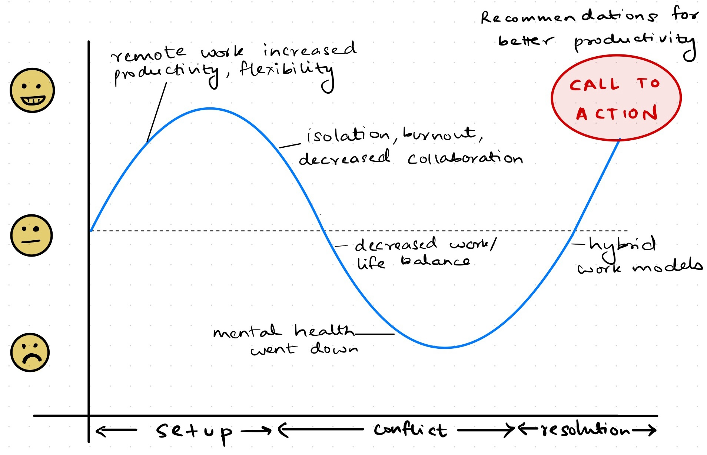
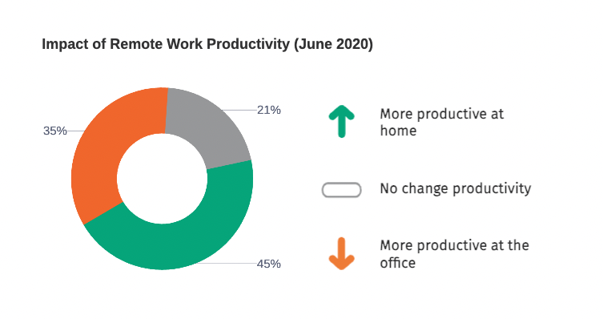
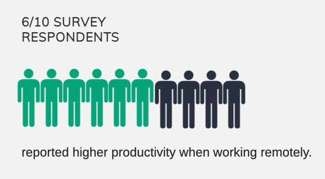
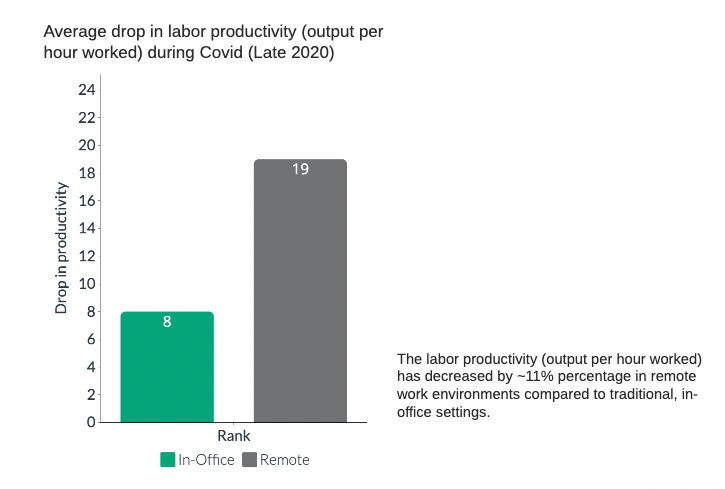
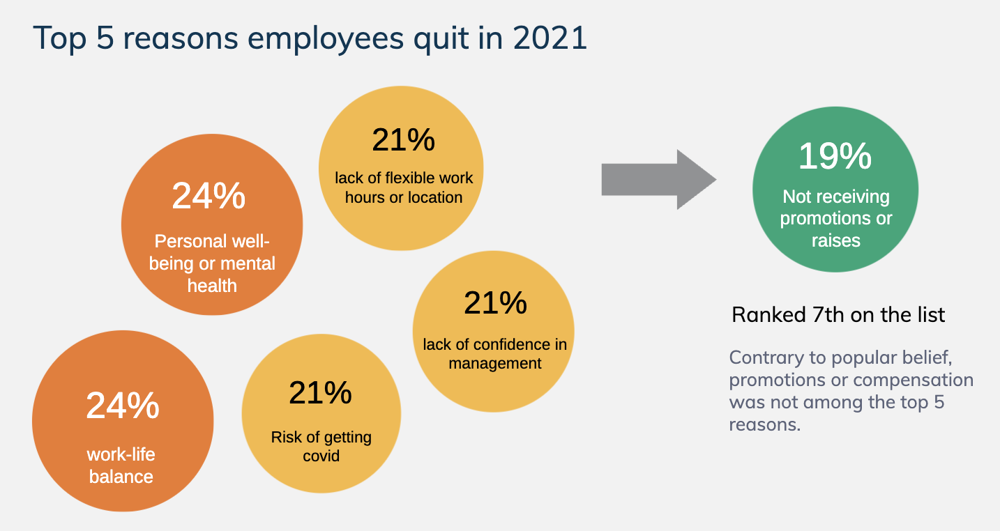
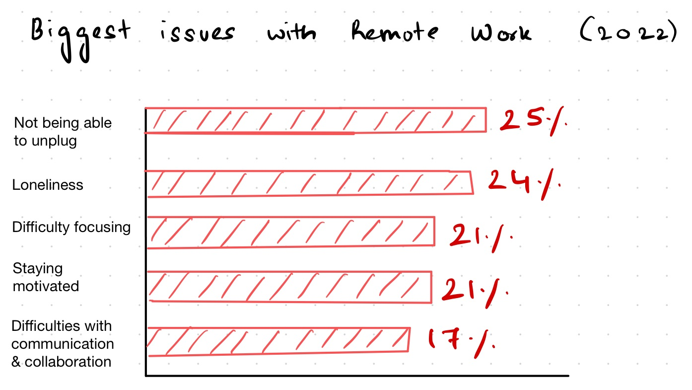
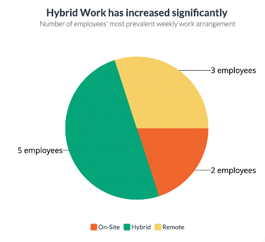

| [home page](https://saylibhavsar.github.io/Data-Visualization-Projects/) | [visualizing debt](https://saylibhavsar.github.io/Data-Visualization-Projects/visualizing-government-debt.html) | [critique by design](https://saylibhavsar.github.io/Data-Visualization-Projects/critique-by-design.html) | [final project I](https://saylibhavsar.github.io/Data-Visualization-Projects/final-project-part-one.html) | [final project II](https://saylibhavsar.github.io/Data-Visualization-Projects/final-project-part-two.html) | [final project III](https://saylibhavsar.github.io/Data-Visualization-Projects/final-project-part-three.html) |

# How Working Remote Affected Productivity 
 
# Outline

## High-level Summary ✍️
During the pandemic, people's work styles shifted as they moved to remote and hybrid models. While remote work first increased productivity by reducing commuting time and providing flexibility, it eventually revealed issues including burnout, a lack of work-life boundaries, and decreased collaboration. My goal is to conclude by discussing the insights gained from the data on how companies can address these challenges. The project offers solutions for companies and people to increase productivity in hybrid or entirely remote settings by harnessing communication tools, mental health support, and flexible work schedules.

## Reader's Objective 📖
As a manager or employee, I'd like to understand how remote and hybrid work affect productivity and what I can do to keep my people/myself productive and engaged. I can do this by developing good communication methods, raising mental health awareness, and have flexible scheduling to avoid burnout.

## Project Structure 🛠️

* **Setup:**
Remote work initially boosted productivity and employee satisfaction by offering flexibility and eliminating/reducing commute time.
* **Conflict:**
As remote work continued, challenges like burnout, reduced collaboration, and blurred work-life boundaries caused productivity to decline.
* **Resolution:**
Adopting hybrid work models, enhancing communication tools, and providing mental health support can sustain productivity in the long term.

## Sections I'd Like to Highlight During My Presentation 💡

**Setup**
* Early stages of remote work: positive outcomes, including improved work-life balance and increased productivity.
* The shift seemed to benefit both employers and employees.
  
**Conflict**
* Challenges like burnout, isolation, and lack of collaboration surfaced.
* Productivity began to decline
* Employees experienced mental health issues due to lack of  boundaries between personal and professional life.

**Resolution**
* Solutions for enhancing productivity can include:
    * Switching to a hybrid work environment
    * Practical strategies such as time blocking, better communication tools.
    * Mental health support: Offer wellness programs, encourage digital detoxes, and provide stress management help.
    * Flexible schedules: Encourage breaks, flexible hours, and work-life balance to avoid burnout and maintain long-term productivity.

## Story Arc 🖋️

## Initial Sketches ✎ᝰ

### **Setup**

1.Initial increase in productivity at the beginning of covid (June 2020)

At the beginning of COVID-19, when people had just started working from home, we saw an initial surge in productivity as reported by employees. Here is an example from the US (2020):

> Source: <a href="https://www-statista-com.cmu.idm.oclc.org/statistics/1140732/work-from-home-productivity-employees-us/">Statista: US Employee Survey on Productivity</a>

 
2.A higher percentage of people reported higher productivity when working remotely, while only 14% proved less productive.

> Source: <a href="https://www.forbes.com/sites/glebtsipursky/2022/11/03/workers-are-less-productive-working-remotely-at-least-thats-what-their-bosses-think/">Forbes</a>

### **Conflict**

1.Within a few months, we noticed a drop in productivity levels (output per hour worked). 

> Source: <a href="https://drive.google.com/file/d/1kqbngD8pemqxAkZmWCOQ32Yk6PXK9eVA/view">Stanford: Evolution of Working From Home</a>

The 8% to 19% drop in productivity is lower than usual productivity levels. This means that labor productivity (output per hour worked) has decreased by that percentage in remote work environments compared to traditional, in-office work settings.

 
2.Change in priorities for employees

People gradually started prioritizing their health and well-being over work than before the pandemic. Surprisingly enough, promotions or compensation was not among the top 5 reasons but rather 7th for employees to quit their jobs in 2021.

> Source: <a href="https://www.microsoft.com/en-us/worklab/work-trend-index/great-expectations-making-hybrid-work-work">Microsoft Work Trend Index</a>

3.People started having major issues with remote work (2022)

> Source: <a href="https://buffer.com/state-of-remote-work/2022">Buffer: State of Remote Work (2022)</a>

4.Google Trends for search terms like “hybrid work” and “mental health remote work” started surging and spiked during different phases of the pandemic.

<noscript></noscript><object class='tableauViz'  style='display:none;'><param name='host_url' value='https%3A%2F%2Fpublic.tableau.com%2F' /> <param name='embed_code_version' value='3' /> <param name='site_root' value='' /><param name='name' value='HybridWorkTrends&#47;HybridWorkTrends' /><param name='tabs' value='no' /><param name='toolbar' value='yes' /><param name='static_image' value='https:&#47;&#47;public.tableau.com&#47;static&#47;images&#47;Hy&#47;HybridWorkTrends&#47;HybridWorkTrends&#47;1.png' /> <param name='animate_transition' value='yes' /><param name='display_static_image' value='yes' /><param name='display_spinner' value='yes' /><param name='display_overlay' value='yes' /><param name='display_count' value='yes' /><param name='language' value='en-US' /><param name='filter' value='publish=yes' /></object>

<noscript></noscript><object class='tableauViz'  style='display:none;'><param name='host_url' value='https%3A%2F%2Fpublic.tableau.com%2F' /> <param name='embed_code_version' value='3' /> <param name='site_root' value='' /><param name='name' value='RemoteWorkMentalHeathTrends&#47;MentalHeathTrends' /><param name='tabs' value='no' /><param name='toolbar' value='yes' /><param name='static_image' value='https:&#47;&#47;public.tableau.com&#47;static&#47;images&#47;Re&#47;RemoteWorkMentalHeathTrends&#47;MentalHeathTrends&#47;1.png' /> <param name='animate_transition' value='yes' /><param name='display_static_image' value='yes' /><param name='display_spinner' value='yes' /><param name='display_overlay' value='yes' /><param name='display_count' value='yes' /><param name='language' value='en-US' /><param name='filter' value='publish=yes' /></object>

This shows how concerns about productivity and work-life balance rose over time.

### **Resolution**

1. Hybrid work started increasing significantly at the end of COVID-19.


> Source: <a href="https://www.gallup.com/workplace/511994/future-office-arrived-hybrid.aspx">Gallup Employee Wellbeing Report</a>

2. Adoption of hybrid work models helped reduce the biggest struggles (e.g., showing a decline in burnout or inability to unplug). 

<noscript></noscript><object class='tableauViz'  style='display:none;'><param name='host_url' value='https%3A%2F%2Fpublic.tableau.com%2F' /> <param name='embed_code_version' value='3' /> <param name='site_root' value='' /><param name='name' value='Struggleswithworkingremotely&#47;StrugglesWFH' /><param name='tabs' value='no' /><param name='toolbar' value='yes' /><param name='static_image' value='https:&#47;&#47;public.tableau.com&#47;static&#47;images&#47;St&#47;Struggleswithworkingremotely&#47;StrugglesWFH&#47;1.png' /> <param name='animate_transition' value='yes' /><param name='display_static_image' value='yes' /><param name='display_spinner' value='yes' /><param name='display_overlay' value='yes' /><param name='display_count' value='yes' /><param name='language' value='en-US' /><param name='filter' value='publish=yes' /></object>

Here, we can see that people struggled a lot in 2021 and 2022, but by 2023, as hybrid work began to take up, these largest issues appeared to have reduced.

## The Data 📊

Data Sources: I plan to use public datasets from Statista and surveys/statistics conducted by companies like Microsoft and Gallup that measure the productivity impact of working from home. I will also be looking into Google Trends to understand how public interest in remote work productivity, burnout, and hybrid work solutions has evolved, providing insights into the growing concerns about maintaining productivity in a post-covid work environment.

Plan for Using Data: I will use this data to analyze productivity trends during the transition to remote and hybrid work, focusing on employee productivity, engagement, and mental health. I will analyze factors such as hours worked, output, and collaboration, using sources like the Gallup Wellbeing Report and Microsoft’s Work Trend Index. Google Trends will highlight public interest in remote work challenges and solutions over time. This data will inform recommendations for adopting hybrid work models, improving communication tools, and offering mental health support to optimize post-pandemic productivity.

| Name   |      Description     | 
|:----------|:-------------|
| [Microsoft Work Trend Index](https://www.microsoft.com/en-us/worklab/work-trend-index/hybrid-work-is-just-work) | Provides global insights into how remote work impacts productivity and employee engagement. |
| [Gallup Employee Wellbeing Report](https://www.gallup.com/workplace/511994/future-office-arrived-hybrid.aspx) | Offers data on employee wellness and mental health, focusing on how burnout affects productivity in remote work. |
| [Buffer State of Remote Work Report](https://buffer.com/state-of-remote-work/2022) | How remote workers from around the world feel about remote work, the pros/cons (2020-2023). |
| [Google Trends](https://trends.google.com/trends/) | - How public interest and concerns around productivity, mental health, and hybrid work have evolved over time.    - Dataset for relevant search terms. |
| [Statista](https://www.statista.com/statistics/1140732/work-from-home-productivity-employees-us/) | - Work from home charts/statistics.    - Dataset for struggles of working remotely. |
| [Forbes article](https://www.forbes.com/sites/richardosibanjo/2022/06/30/the-post-pandemic-office-how-to-win-employees-back/) | Remote Work Productivity vs in-office. |
| [Stanford article](https://drive.google.com/file/d/1kqbngD8pemqxAkZmWCOQ32Yk6PXK9eVA/view) | Measuring drop in productivity during and post covid. |

## Method and Medium ⚙️

I will be using the following tools for my project:
* **Tableau:** for creating interactive data visualizations
* **Shorthand:** for developing my story narrative and website
* **Visme:** for creating custom visuals that support my story arc

My aim is to include graphics, such as productivity trends, employee engagement, and mental health metrics, to help the audience quickly understand the key takeaways. These visuals will illustrate the impact of remote and hybrid work on productivity and highlight areas where improvements can be made.

Finally, my call to action will include actionable strategies for optimizing productivity in hybrid/remote work environments:
* Implementing better communication tools to improve collaboration.
* Providing mental health support through wellness programs and stress management resources.
* Encouraging flexible work schedules to maintain work-life balance and prevent burnout.

