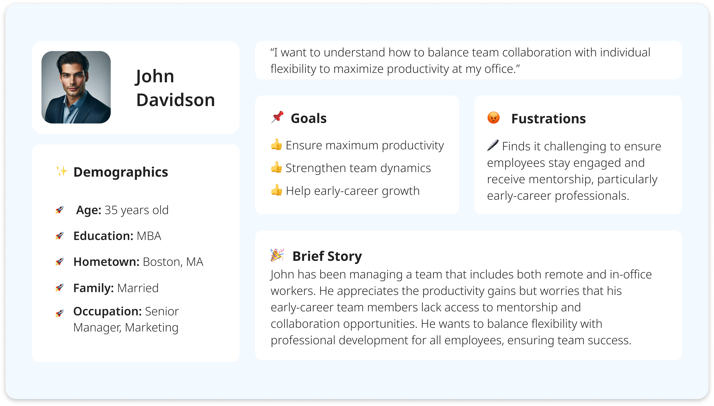
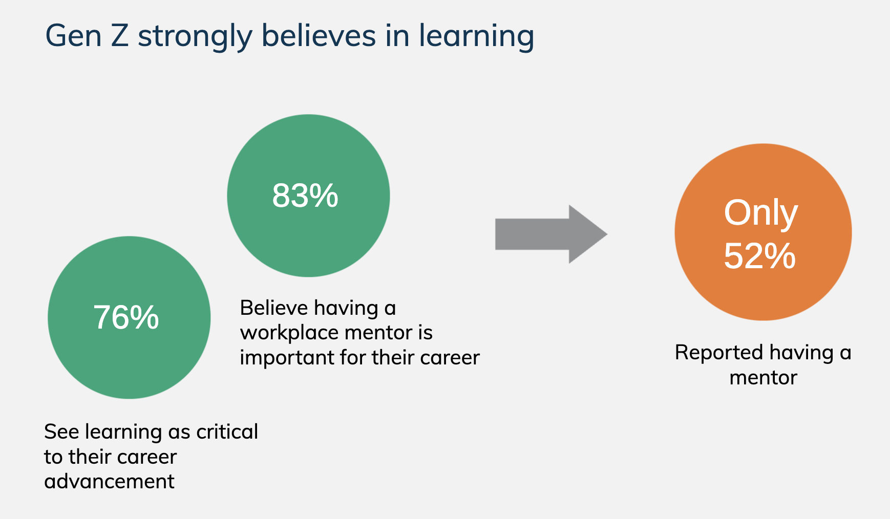
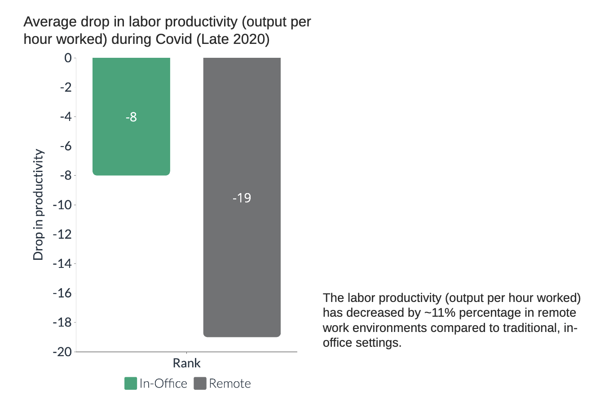
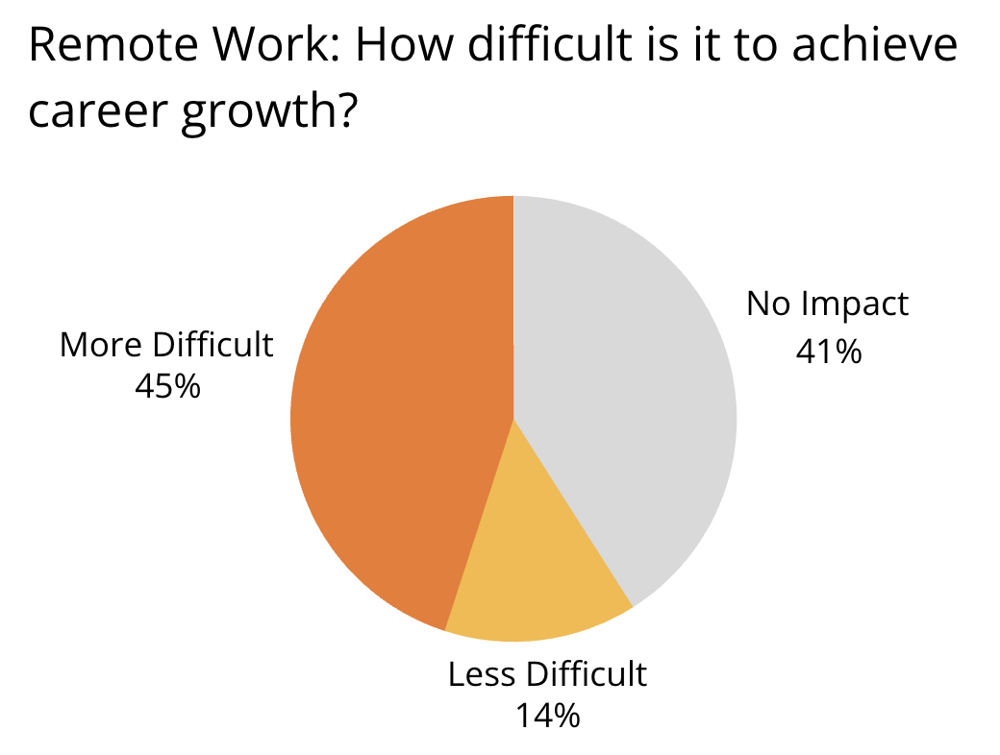
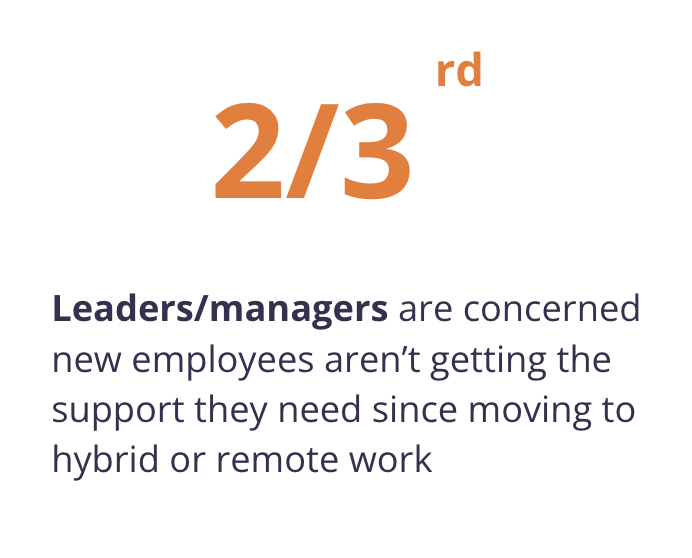

| [home page](https://saylibhavsar.github.io/Data-Visualization-Projects/) | [visualizing debt](visualizing-government-debt.md) | [critique by design](critique-by-design.md) | [final project I](final-project-part-one.md) | [final project II](final-project-part-two.md) | [final project III](final-project-part-three.md) |

# The Hybrid Work Solution: Balancing Career Growth and Productivity for Early-Career Professionals
 
## Outline

This project looks at the trade-offs of remote and hybrid work arrangements, with recommendations for early-career professionals. It focuses on how diverse work paradigms affect productivity and career success. The study presents hybrid work as a well-balanced option that meets the demands of both flexibility and professional progress by illuminating how managers and employees balance the advantages and disadvantages of each work environment.

* Overview of the shift to remote work during the pandemic and its initial positive effects on productivity and employee satisfaction.
* Highlight the emerging issues with sustaining remote work, especially for early-career professionals who require mentorship and growth opportunities.

## Reader's Objective 📖
As a manager or early-career employee, I want to understand how different work models, affect career development and productivity. I seek practical insights on how to stay productive, engaged, and facilitate career growth in these work environments.

## Personas 🙋🏻‍♀️

 

## Project Structure 🛠️

* **Setup:**
At the pandemic's beginning, remote work boosted productivity by offering flexibility and eliminating commutes. Gen Z, focused on career growth, saw learning and mentorship as critical but struggled to find these opportunities in a remote setting.
* **Conflict:**
Over time, remote work reduced productivity and made it more difficult for professionals to advance in their careers. New employees onboarded during the pandemic faced additional challenges, feeling excluded and disconnected.
* **Resolution:**
Hybrid work emerged as a solution, combining remote flexibility with in-person collaboration, improving team relationships, and decreasing struggles like burnout and lack of mentorship.

## High-Fidelity Wireframes

### **Setup**

1.Initial increase in productivity at the beginning of covid (June 2020)

At the beginning of COVID-19, when people had just started working from home, we saw an initial surge in productivity as reported by employees. Here is an example from the US (2020):

> Source: <a href="https://www-statista-com.cmu.idm.oclc.org/statistics/1140732/work-from-home-productivity-employees-us/">Statista: US Employee Survey on Productivity</a>

 
2. Mentorship Importance for Gen Z: As Gen Z entered the workforce, 76% emphasized that continuous learning is critical to their career advancement, highlighting the need for mentorship, which became more difficult to access remotely.

> Source: <a href="https://www.mentorcliq.com/blog/mentoring-stats/">MentorCliq: 40+ Definitive Mentorship Statistics and Research for 2024</a>

### **Conflict**

1.Within a few months, we noticed a drop in productivity levels (output per hour worked). 

> Source: <a href="https://drive.google.com/file/d/1kqbngD8pemqxAkZmWCOQ32Yk6PXK9eVA/view">Stanford: Evolution of Working From Home</a>

The 8% to 19% drop in productivity is lower than usual productivity levels. This means that labor productivity (output per hour worked) has decreased by that percentage in remote work environments compared to traditional, in-office work settings.

 
2. Career Progression Difficulties: 45% of early-career professionals felt that remote work made career progression more difficult, as they lacked in-person mentorship and networking opportunities.

> Source: <a href="https://buffer.com/state-of-remote-work/2022">Buffer: State of Remote Work (2022)</a>

 
3.Support for New Employees: Employees hired during COVID-19 (After March 2020) struggled more than their in-office counterparts, feeling less connected to their teams and at greater risk of leaving their jobs. Managers are also concerned about the support that new employees are gettings after moving to remote work.

> Source: <a href="https://www.microsoft.com/en-us/worklab/work-trend-index/great-expectations-making-hybrid-work-work#:~:text=%E2%80%9CWhen%20people%20trust%20one%20another,and%20creativity%20and%20less%20groupthink.%E2%80%9D&text=Our%20research%20shows%20many%20hybrid,employer%20in%20the%20year%20ahead)">Microsoft Work Trend Index</a>

<noscript></noscript><object class='tableauViz'  style='display:none;'><param name='host_url' value='https%3A%2F%2Fpublic.tableau.com%2F' /> <param name='embed_code_version' value='3' /> <param name='site_root' value='' /><param name='name' value='NewEmployeeCovid&#47;NewEmployees' /><param name='tabs' value='no' /><param name='toolbar' value='yes' /><param name='static_image' value='https:&#47;&#47;public.tableau.com&#47;static&#47;images&#47;Ne&#47;NewEmployeeCovid&#47;NewEmployees&#47;1.png' /> <param name='animate_transition' value='yes' /><param name='display_static_image' value='yes' /><param name='display_spinner' value='yes' /><param name='display_overlay' value='yes' /><param name='display_count' value='yes' /><param name='language' value='en-US' /><param name='filter' value='publish=yes' /></object>

 

4.Google Trends for search terms like “hybrid work” and “mental health remote work” started surging and spiked during different phases of the pandemic.

<noscript></noscript><object class='tableauViz'  style='display:none;'><param name='host_url' value='https%3A%2F%2Fpublic.tableau.com%2F' /> <param name='embed_code_version' value='3' /> <param name='site_root' value='' /><param name='name' value='HybridWorkTrends&#47;HybridWorkTrends' /><param name='tabs' value='no' /><param name='toolbar' value='yes' /><param name='static_image' value='https:&#47;&#47;public.tableau.com&#47;static&#47;images&#47;Hy&#47;HybridWorkTrends&#47;HybridWorkTrends&#47;1.png' /> <param name='animate_transition' value='yes' /><param name='display_static_image' value='yes' /><param name='display_spinner' value='yes' /><param name='display_overlay' value='yes' /><param name='display_count' value='yes' /><param name='language' value='en-US' /><param name='filter' value='publish=yes' /></object>

<noscript></noscript><object class='tableauViz'  style='display:none;'><param name='host_url' value='https%3A%2F%2Fpublic.tableau.com%2F' /> <param name='embed_code_version' value='3' /> <param name='site_root' value='' /><param name='name' value='RemoteWorkMentalHeathTrends&#47;MentalHeathTrends' /><param name='tabs' value='no' /><param name='toolbar' value='yes' /><param name='static_image' value='https:&#47;&#47;public.tableau.com&#47;static&#47;images&#47;Re&#47;RemoteWorkMentalHeathTrends&#47;MentalHeathTrends&#47;1.png' /> <param name='animate_transition' value='yes' /><param name='display_static_image' value='yes' /><param name='display_spinner' value='yes' /><param name='display_overlay' value='yes' /><param name='display_count' value='yes' /><param name='language' value='en-US' /><param name='filter' value='publish=yes' /></object>

This shows how concerns about productivity and work-life balance rose over time.

### **Resolution**

1.Hybrid work emerged as the balanced answer, providing both flexibility and structured in-office collaboration to boost engagement and development.
We see a decrease in major employee struggles when Hybrid work came into play.

<noscript></noscript><object class='tableauViz'  style='display:none;'><param name='host_url' value='https%3A%2F%2Fpublic.tableau.com%2F' /> <param name='embed_code_version' value='3' /> <param name='site_root' value='' /><param name='name' value='HybridWorkTrends&#47;StrugglesWFH' /><param name='tabs' value='no' /><param name='toolbar' value='yes' /><param name='static_image' value='https:&#47;&#47;public.tableau.com&#47;static&#47;images&#47;Hy&#47;HybridWorkTrends&#47;StrugglesWFH&#47;1.png' /> <param name='animate_transition' value='yes' /><param name='display_static_image' value='yes' /><param name='display_spinner' value='yes' /><param name='display_overlay' value='yes' /><param name='display_count' value='yes' /><param name='language' value='en-US' /><param name='filter' value='publish=yes' /></object>

Here, we can see that people struggled a lot in 2021 and 2022, but by 2023, as hybrid work began to take up, these largest issues appeared to have reduced.

2.Improved Workplace Relationships: We see that hybrid employees were more successful at maintaining relationships with their teams, with many reporting a decrease in struggles like burnout and isolation.

<noscript></noscript><object class='tableauViz'  style='display:none;'><param name='host_url' value='https%3A%2F%2Fpublic.tableau.com%2F' /> <param name='embed_code_version' value='3' /> <param name='site_root' value='' /><param name='name' value='WorkplaceRelationship&#47;WorkplaceRelationship' /><param name='tabs' value='no' /><param name='toolbar' value='yes' /><param name='static_image' value='https:&#47;&#47;public.tableau.com&#47;static&#47;images&#47;Wo&#47;WorkplaceRelationship&#47;WorkplaceRelationship&#47;1.png' /> <param name='animate_transition' value='yes' /><param name='display_static_image' value='yes' /><param name='display_spinner' value='yes' /><param name='display_overlay' value='yes' /><param name='display_count' value='yes' /><param name='language' value='en-US' /><param name='filter' value='publish=yes' /></object>

 
## User Research Protocol 📓

**A.Target Audience**
* Early-Career Professionals: Individuals in their first 1-3 years of work (or entering the workforce soon), balancing productivity, mentorship, and career development in remote/hybrid environments.
* Managers/Team Leaders: Leaders overseeing employees (particularly early-career professionals) in hybrid/remote models, concerned with engagement, productivity, and team collaboration.

**B.Approach to Identifying Interviewees**
* I reached out to two students and one manager to gather both perspectives: the new grad employee's experience of navigating productivity and career development in remote/hybrid work, and the manager’s perspective on leading and mentoring employees (particularly early career) in these environments. This ensures a balanced understanding of the challenges and opportunities from both sides, forming the project’s narrative and visualizations.

**C.Questions/Script:**

1. As a grad student entering the job market soon, what part of the story resonates with you the most? Why?
2. Does the narrative communicate the trade-offs between remote and hybrid work in terms of career development and productivity?
3. Do the visualizations effectively support and enhance the key points in the story?
4. Was the flow of the story and visualizations easy to follow? Did the structure make sense?
5. Do you have any suggestions for improving the user experience in terms of layout, design, or flow?
