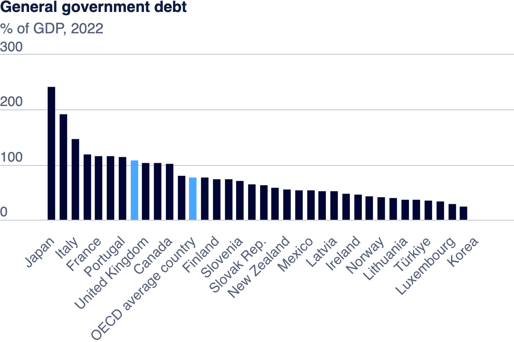

| [home page](https://saylibhavsar.github.io/Data-Visualization-Projects/) | [visualizing debt](visualizing-government-debt.md) | [critique by design](critique-by-design.md) | [final project I](final-project-part-one.md) | [final project II](final-project-part-two.md) | [final project III](final-project-part-three.md) |

# Visualizing Government Debt

> Graph by <a href="https://www.oecd.org/en/data/indicators/general-government-debt.html">OECD</a>, Source <a href="https://data-explorer.oecd.org/vis?lc=en&ac=false&tm=DF_GOV_PF_YU&pg=0&snb=1&vw=tb&df[ds]=dsDisseminateFinalDMZ&df[id]=DSD_GOV%40DF_GOV_PF_YU&df[ag]=OECD.GOV.GIP&df[vs]=&pd=2007%2C&dq=A.AUT.....&to[TIME_PERIOD]=false">OECD Data Explorer</a>

> Graph by <a href="https://www.oecd.org/en/data/indicators/general-government-debt.html">OECD</a>, Source <a href="https://data-explorer.oecd.org/vis?lc=en&ac=false&tm=DF_GOV_PF_YU&pg=0&snb=1&vw=tb&df[ds]=dsDisseminateFinalDMZ&df[id]=DSD_GOV%40DF_GOV_PF_YU&df[ag]=OECD.GOV.GIP&df[vs]=&pd=2007%2C&dq=A.AUT.....&to[TIME_PERIOD]=false">OECD Data Explorer</a>
